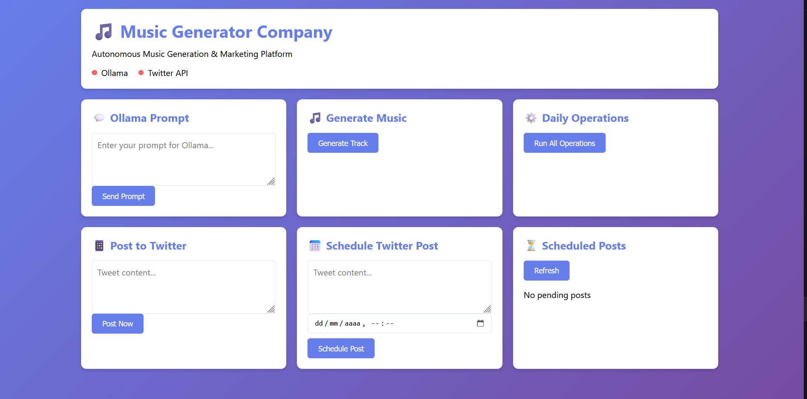

# Music Generator Company – RAG Prototype



## Overview

Autonomous music generation company with **AI-powered music creation**, billing, and marketing automation. Built for the CloudWalk Level 2.3 challenge with production-ready practices.

### Key Features

- 🎵 **AI Music Generation**: Ollama (llama2) generates creative tracks
- 🧠 **RAG System**: ChromaDB vector database for contextual generation  
- ⏰ **Mood-Based**: Time-aware mood selection (morning/afternoon/evening)
- 🎨 **Genre Diversity**: Automatic genre rotation for variety
- 💳 **Billing Automation**: Monthly subscription processing ($1/user)
- 📱 **Marketing Agent**: Twitter post generation and scheduling
- 🌐 **Web Interface**: Interactive dashboard for management
- ⚡ **Background Tasks**: Automatic daily operations

---

## Tech Stack

- **Python 3.8+**
- **Flask** - Web framework
- **Ollama + llama2** - Local LLM
- **LangChain** - LLM orchestration
- **ChromaDB** - Vector database
- **Requests** - HTTP client

---

## Quick Start

### 1. Install Ollama

Download: https://ollama.com/download

```powershell
ollama pull llama2
```

### 2. Install Dependencies

```powershell
python -m venv venv
.\venv\Scripts\Activate.ps1
pip install -r requirements.txt
```

### 3. Run

**Web Interface:**
```powershell
python web_app.py
```
Access: http://127.0.0.1:5000

**CLI:**
```powershell
python main.py
```

---

---

## Project Structure

```
prototype/
├── agents/
│   ├── music_agent.py      # AI music generation with LLM
│   ├── billing_agent.py    # Subscription billing
│   └── marketing_agent.py  # Social media automation
├── templates/
│   └── index.html          # Web dashboard UI
├── assets/
│   └── image.png           # Project image
├── config.py               # Configuration constants
├── knowledge.py            # ChromaDB vector store (RAG)
├── knowledge_simple.py     # JSON fallback storage
├── llm_service.py          # LangChain + Ollama
├── llm_service_simple.py   # Direct Ollama API
├── orchestrator.py         # Agent coordination
├── scheduler.py            # Background task runner
├── twitter_service.py      # Twitter integration (simulation)
├── web_app.py              # Flask web server
├── main.py                 # CLI entry point
├── requirements.txt        # Python dependencies
├── .gitignore              # Git ignore rules
└── README.md               # This file
```

---

## Architecture

### RAG Implementation

**ChromaDB Vector Store:**
- Semantic search for similar tracks
- Genre and mood embeddings
- Historical track analysis
- Marketing template retrieval

**LangChain Orchestration:**
- Prompt engineering for music generation
- Chain composition for complex workflows
- LLM output parsing and validation
- Fallback handling

**Ollama LLM:**
- Local llama2 model inference
- No API keys required
- Privacy-preserving
- Fast local generation

### Agent System

**MusicAgent:**
- Queries ChromaDB for similar tracks
- Uses LLM to generate creative titles
- Contextual genre/mood selection
- Time-aware generation (morning/afternoon/evening)
- Genre diversity enforcement

**BillingAgent:**
- Deterministic subscription processing
- Monthly billing at $1/user
- Payment tracking and reporting
- No AI needed (simple business logic)

**MarketingAgent:**
- Generates Twitter posts with LLM
- Hashtag optimization
- Engagement score prediction
- Scheduling and automation

### Orchestrator

Coordinates daily operations:
1. Music generation (with RAG context)
2. Billing processing
3. Marketing content creation
4. Background task scheduling

---

## Usage

### Web Interface

Start server:
```powershell
python web_app.py
```

Features:
- Generate music with custom prompts
- View system status and metrics
- Schedule Twitter posts
- Immediate posting (simulation mode)
- Monitor pending schedules

### CLI Mode

Run daily operations:
```powershell
python main.py
```

Example output:
```
============================================================
DAILY OPERATIONS SUMMARY
============================================================

[MUSIC] Music Generation
   Track: "Electric Motion"
   Genre: electronic
   Mood: focused
   Method: llm

[BILLING] Billing
   Processed: 4/4 users
   Revenue: $4.00
   Failed: 0

[MARKETING] Marketing
   Platform: twitter
   Post: New Electronic track: "Electric Motion"!
   Scheduled: 9am
   Engagement Score: 850

============================================================
[OK] Operations completed
============================================================
```

---

## API Endpoints

### System Status
```http
GET /api/status
```

### Generate Music
```http
POST /api/generate
Content-Type: application/json

{
  "mood": "energetic"
}
```

### Ollama Prompt
```http
POST /api/ollama/prompt
Content-Type: application/json

{
  "prompt": "Create an uplifting electronic track"
}
```

### Schedule Twitter Post
```http
POST /api/twitter/schedule
Content-Type: application/json

{
  "content": "New track released!",
  "scheduled_time": "2026-01-12T09:00:00"
}
```

### Post Immediately
```http
POST /api/twitter/post-now
Content-Type: application/json

{
  "content": "Breaking: New release!"
}
```

### Pending Posts
```http
GET /api/twitter/pending
```

---

## Configuration

Edit `config.py` to customize:

**Ollama Settings:**
- Model name (default: llama2)
- Temperature (default: 0.7)
- Base URL (default: localhost:11434)

**Music Generation:**
- Genre pool and characteristics
- Mood mappings by time of day
- Genre avoidance window

**Billing:**
- Subscription pricing
- User database

**Marketing:**
- Twitter posting schedule
- Engagement metrics
- Hashtag rules

---

## CloudWalk Challenge Compliance

✅ **Goal**: Autonomous music generation company

✅ **Required Tasks:**
- Music Agent: AI music generation daily
- Billing Agent: Monthly payment processing ($1)
- Marketing Agent: Social media automation

✅ **Bonus Features:**
- Spotify-like playlist builder (genre diversity)
- Mood-based generation (time-aware)

✅ **Production Best Practices:**
- Modular architecture
- Dependency injection
- Professional logging
- Error handling with fallbacks
- Configuration management
- RESTful API design
- Background scheduling
- Vector database (RAG)
- LLM orchestration

---

## Development

### Testing

Music generation:
```powershell
python main.py
```

Web API:
```powershell
python test_api.py
```

### Logs

All operations logged with levels:
- **INFO**: Normal operations
- **WARNING**: Fallback modes, degraded features
- **ERROR**: Failures (with graceful handling)

---

## Production Deployment

See [DEPLOYMENT.md](DEPLOYMENT.md) for:
- Production server setup (Gunicorn/Waitress)
- Environment variables
- Monitoring and troubleshooting
- Performance tuning

---

## License

MIT

---

## Author

Created for CloudWalk Level 2.3 Challenge

---

## Support

Check logs for detailed error messages. All warnings are normal - the system gracefully degrades when optional features are unavailable.
- Monitoring and troubleshooting
- Performance tuning

------

## System Diagram

```
┌──────────────────────────────────────────┐
│     Autonomous Music Company             │
│   (Ollama + LangChain + ChromaDB)        │
└──────────────────────────────────────────┘
              │
    ┌─────────┼─────────┐
    │         │         │
┌───▼───┐ ┌──▼──┐ ┌────▼─────┐
│ Music │ │Bill │ │Marketing │
│ Agent │ │Agent│ │  Agent   │
│ (LLM) │ │(Det)│ │  (LLM)   │
└───┬───┘ └──┬──┘ └────┬─────┘
    │        │         │
    └────────┼─────────┘
             │
    ┌────────▼────────┐
    │   ChromaDB      │
    │ Vector Store    │
    │  + JSON Data    │
    └─────────────────┘
             │
    ┌────────▼────────┐
    │  Ollama LLM     │
    │   (llama2)      │
    └─────────────────┘
```

---

## Running the Application

### Option 1: Docker (Recommended for Production)

```bash
# Linux/Mac
./deploy.sh

# Windows PowerShell
.\deploy.ps1
```

Access the web interface at http://localhost:5000

### Option 2: Local Development

**Prerequisites:**
1. Python 3.8+
2. Ollama (optional): https://ollama.ai

**Setup:**
```bash
# Install dependencies
pip install -r requirements.txt

# Copy environment file
cp .env.example .env

# Run web interface
python web_app.py
```

Access at http://localhost:5000

### Option 3: CLI Mode

```bash
python main.py
```

## Features

### Web Interface
- **Ollama Prompt Interface**: Send custom prompts directly to Ollama
- **Music Generation**: Generate tracks with one click
- **Twitter Integration**: Post immediately or schedule tweets
- **Real-time Status**: Monitor system health and services
- **Background Scheduler**: Automatic processing of scheduled posts

### Twitter Scheduling
- Schedule posts for specific times
- View pending scheduled posts
- Automatic posting at scheduled times
- Works in simulation mode without API credentials

### Production Ready
- Docker deployment with health checks
- Gunicorn WSGI server
- Background task scheduler
- Comprehensive logging
- Environment-based configuration

## API Endpoints

### Music Generation
- `POST /api/generate` - Generate new music track
- `GET /api/status` - System health and status

### Ollama Integration
- `POST /api/ollama/prompt` - Send custom prompt to Ollama
  ```json
  {"prompt": "Your prompt here"}
  ```

### Marketing
- `POST /api/marketing/create` - Create marketing post for track

### Twitter
- `POST /api/twitter/post-now` - Post immediately
  ```json
  {"content": "Your tweet"}
  ```
- `POST /api/twitter/schedule` - Schedule post
  ```json
  {"content": "Your tweet", "scheduled_time": "2026-01-11T14:30:00"}
  ```
- `GET /api/twitter/pending` - Get scheduled posts
- `GET /api/twitter/posted` - Get posted content

### Operations
- `POST /api/operations/run` - Run all daily operations

Example output:

```
INFO - Initializing Music Generator Company
INFO - Initializing agents...
INFO - All agents initialized successfully
INFO - Starting daily operations
INFO - Generating music track
INFO - Generated track: Bright Flow (electronic)
INFO - Processing monthly billing
INFO - Billing processed: $5.00 revenue
INFO - Creating marketing content
INFO - Marketing post created for Bright Flow

============================================================
DAILY OPERATIONS SUMMARY
============================================================

🎵 Music Generation
   Track: Bright Flow
   Genre: electronic
   Mood: energetic
   Method: llm

💳 Billing
   Processed: 5/5 users
   Revenue: $5.00
   Failed: 0

📱 Marketing
   Platform: twitter
   Post: 🎵 Fresh electronic vibes! Check out 'Bright Flow' 🔥 #Electronic #EDM
   Scheduled: 9am
   Engagement Score: 850

============================================================
✅ Operations completed
============================================================
```

See [SETUP.md](SETUP.md) for detailed setup instructions and architecture documentation.

---

## Notes

This prototype demonstrates:

* **Production-ready RAG**: ChromaDB + LangChain architecture
* **Local-first AI**: Ollama runs entirely on your machine
* **Context-aware decisions**: Vector search improves agent intelligence
* **Graceful degradation**: Fallback logic ensures reliability
* **Scalable patterns**: Architecture suitable for production systems

Technology stack:
- **Ollama**: Local LLM inference (llama2)
- **LangChain**: LLM orchestration and prompt management
- **ChromaDB**: Vector database for semantic search
- **Python**: Application logic and agent coordination

---

## Repository Contents

* **Core Application**
  * `main.py` – CLI entry point
  * `web_app.py` – Web interface and API server
  * `config.py` – Configuration and constants
  * `orchestrator.py` – Agent coordination

* **Services**
  * `llm_service.py` – LLM abstraction (Ollama)
  * `llm_service_simple.py` – Fallback without LangChain
  * `knowledge.py` – Vector store management (ChromaDB)
  * `knowledge_simple.py` – Fallback JSON storage
  * `twitter_service.py` – Twitter posting and scheduling
  * `scheduler.py` – Background task scheduler

* **Agents**
  * `agents/music_agent.py` – Music generation
  * `agents/billing_agent.py` – Subscription billing
  * `agents/marketing_agent.py` – Content generation

* **Web Interface**
  * `templates/index.html` – Dashboard UI

* **Deployment**
  * `Dockerfile` – Container configuration
  * `docker-compose.yml` – Multi-service orchestration
  * `deploy.sh` – Linux/Mac deployment script
  * `deploy.ps1` – Windows deployment script
  * `requirements.txt` – Python dependencies

* **Documentation**
  * `README.md` – This document
  * `SETUP.md` – Setup and architecture guide
  * `DEPLOYMENT.md` – Production deployment guide
  * `IMPROVEMENTS.md` – Refactoring documentation

* **Configuration**
  * `.env.example` – Environment template
  * `knowledge_base.json` – Base configuration data
  * `twitter_schedule.json` – Scheduled posts (generated)

---

**Author:** Juan
**Challenge:** CloudWalk AI Wizard – Level 2.3


